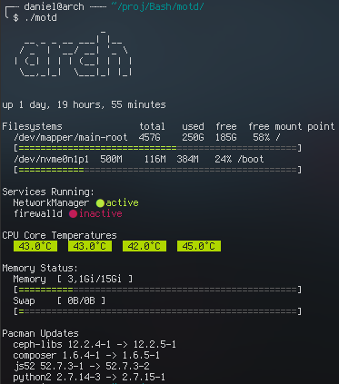

# motd

A fancy motd with system status inspired by /r/unixporn.

Inspiration by: [https://www.reddit.com/r/unixporn/comments/8gwcti/motd_ubuntu_server_1804_lts_my_motd_scripts_for/](https://www.reddit.com/r/unixporn/comments/8gwcti/motd_ubuntu_server_1804_lts_my_motd_scripts_for/)

## Screenshot

## License

(c) 2018 Bernd Busse, Daniel Jankowski  
Licensed under the GNU Lesser General Public License 3 (LGPLv3). See [LICENSE](./LICENSE) for details.
